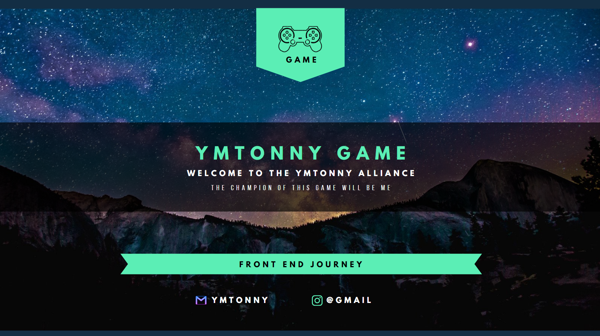

👋 &nbsp;Hey there! I'm ymTonny

### 👨🏻‍💻 &nbsp;About Me

💡 &nbsp;I like to explore new technologies and develop software solutions.\
🎓 &nbsp;I am working hard to be a qualified front end engineer.\
🌱 &nbsp;I'm learning more about the front end and building a solid system.\
✍️ &nbsp;In my spare time, I like to catch up with drama and understand all kinds of front-end problems.\
💬 &nbsp;Feel free to reach out to me for pro bono consulting and volunteering, or just for some interesting discussion.\
✉️ &nbsp;You can shoot me an email at ymtonny@gmail.com! I'll try to respond as soon as I can.\
📄 &nbsp;Please have a look at my [Résumé](https://ymtonny.cn) for more details about me. !

### 🛠 &nbsp;Tech Stack

&nbsp;
&nbsp;
&nbsp;
&nbsp;\
&nbsp;
&nbsp;
&nbsp;
\
&nbsp;
&nbsp;
&nbsp;
&nbsp;
\
&nbsp;
&nbsp;

### ⚙️ &nbsp;GitHub Analytics

